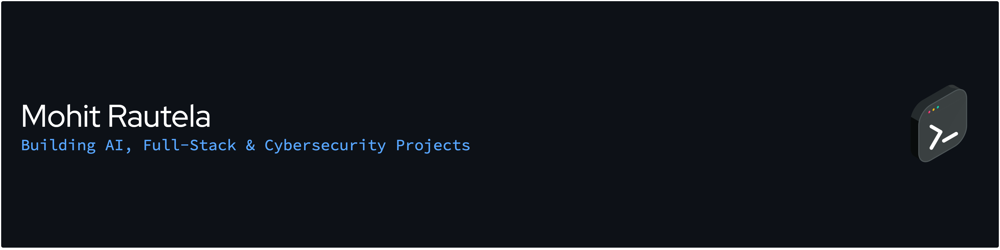

  

<h1 align="center">Hi 👋, I'm Mohit Rautela</h1>

  

---

## 👨‍💻 About Me

I'm a Computer Science student passionate about building software that solves real-world problems. I enjoy developing full-stack applications, exploring AI-powered solutions, and learning cybersecurity through hands-on projects.

- 💻 Full-Stack Development
- 🤖 AI & Automation
- 🔒 Cybersecurity
- 🌱 Learning Japanese and continuously improving my technical skills
- 🚀 Always building and experimenting with new ideas

## ⚡ Tech Stack

---

## 🚀 Featured Projects

| Project | Description |
|---------|-------------|
| 🖥 **MohitOS** | Interactive Windows-inspired portfolio experience |
| 📄 **DocsFlow** | AI-powered OCR document management system |
| 📶 **WiFi Analyzer** | WiFi reconnaissance and analysis dashboard |
| 🍣 **Umaii Restaurant** | Responsive Japanese restaurant website |

---

## 📊 GitHub Statistics

---

## 🎯 Currently Working On

- 🖥 MohitOS
- 📄 DocsFlow
- 🔒 Cybersecurity Labs
- 🤖 AI-powered Applications

---

## 📫 Connect With Me

  

  

  

